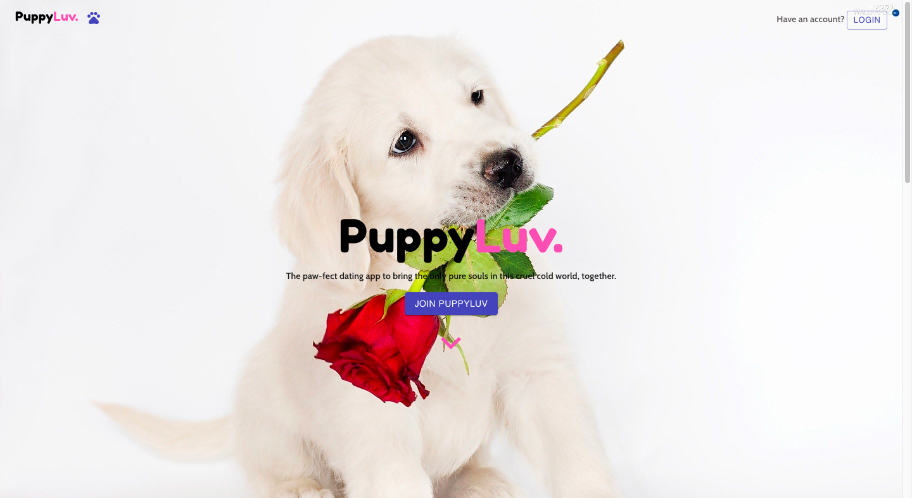
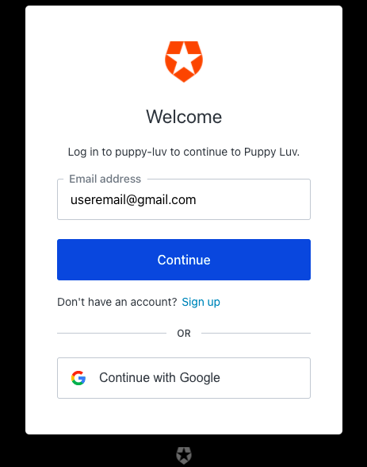

    

<!-- <h2 style="text-align:center">PuppyLuv</h2> -->

## Overview

PuppyLuv is a fun application for pet lovers that want to connect with each other and share their fur babies’ stories! In this app you can create an account using your email address and password. Once you are logged in you are able to input your information
    such as first name, last name, age, gender, city, zip code, user image and number of pets. You are also able to add your pets’ information such as name, breed, age, personality and select an image for each of your pets (up to three pets). Other
    fun features are that you are able to select profiles of people around you and favorite them, chat with them and maybe meet up at a dog park to have a doggy play-date!

    

## Features

<li>User sign-up & login</li>
<li>Upload profile & pet pictures</li>
<li>Favorite a profile </li>
<li>Find a park near you</li>

<h3 style="color:blueviolet">Technical Framework</h3>
<h4 style="color:crimson">Front-end Technologies</h4>
<li>Custom Styled Components</li>
<li>Bootstrap</li>
<li>Material UI</li>
<li>Auth0</li>
<li>CSS </li>

<h4 style="color:crimson">Back-end Technologies</h4>

<li>JavaScript</li>
<li>Express</li>
<li>ElephantSQL</li>
<li>PostgreSQL</li>

<h3 style="color:blueviolet">Miscellaneous</h3>
<li>Firebase</li>
<li>Google API</li>
<li>Trello</li>
<li>Github</li>
<li>LucidChart</li>

## Created by

<h4>Kurtis Garcia: Full-stack Developer
    <a href="https://github.com/kgarcia14">github.com/kgarcia14</a>
</h4>

<li>PM/SCRUM Master Coding and development, Trello, wireframing, front-end structuring, Styling.
</li>

<h4>Sean McEchaern: Full-stack Developer
    <a href="https://github.com/sean-mac1357">github.com/sean-mac1357</a>
</h4>
<li>
    Coding and development, back-end SQL DB, front-end Auth0 feature, Cors, Firebase.
</li>
<h4>Susan Yun: Full-stack Developer
    <a href="https://github.com/sujjanyun">github.com/sujjanyun</a>
</h4>
<li>
    UX designer, front-end, design logo, Styles
</li>

<h4>Terrence Childs: Full-stack Developer
    <a href="https://github.com/tchilds11">github.com/tchilds11</a>
</h4>
<li>
    Coding and development, front-end, firebase, messaging design.
</li>

<h4>Hilda Robles: Full-stack Developer
    <a href="https://github.com/hpatrob82">github.com/hpatrob82</a>
</h4>
<li>
    Coding and development, back-end Postico, ElephantSQL DB, and ReadMe file.
</li>

    

